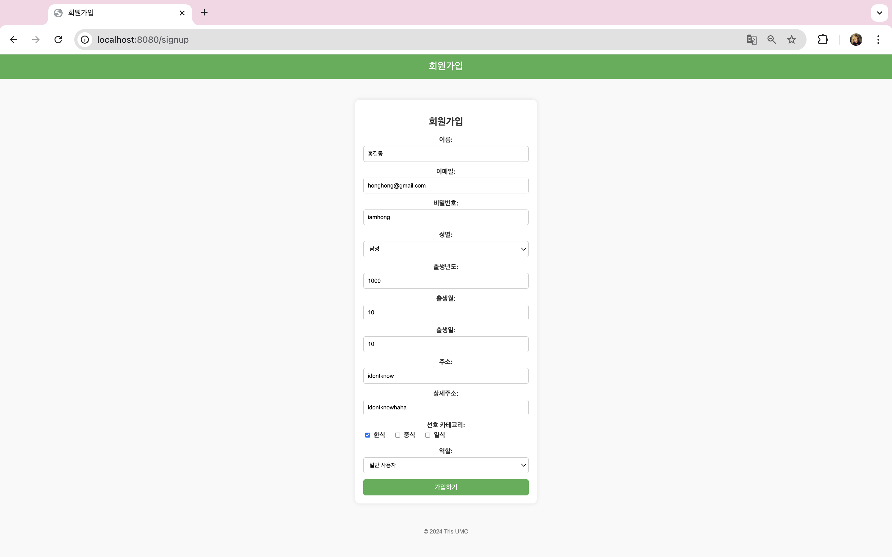
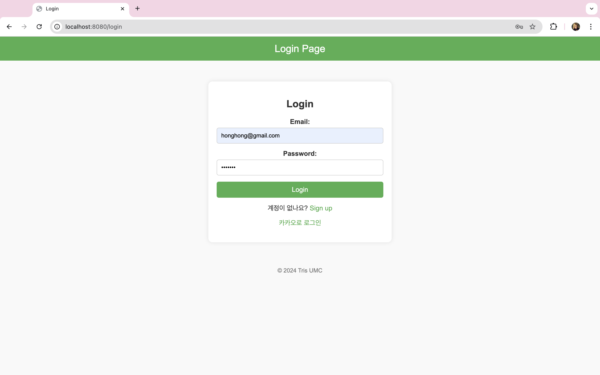
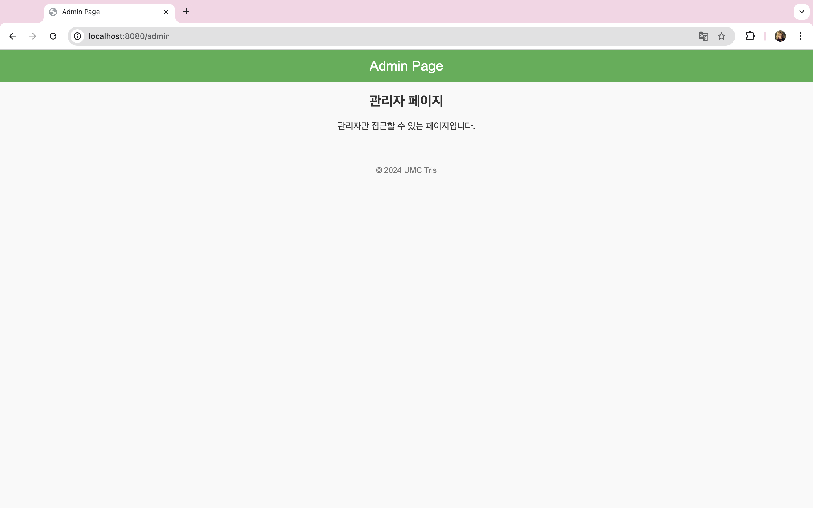
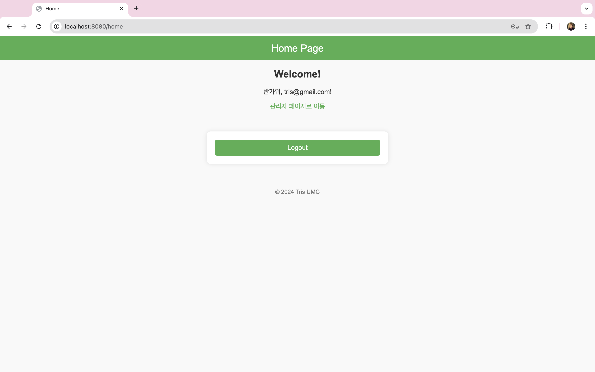

# UMC 워크북 실습 - 트리스 

### 실습 내용
- UMC 트리스 워크북: [트리스](https://www.notion.so/makeus-challenge/fffb57f4596b814a957aff3417f926be)

### 실행 방법
- `spring/src/main/java/umc/spring/Application.java` 실행

### 데모 페이지
- Signup 페이지
  
- Login 페이지
  
- Admin 페이지
  
- Home 페이지
  